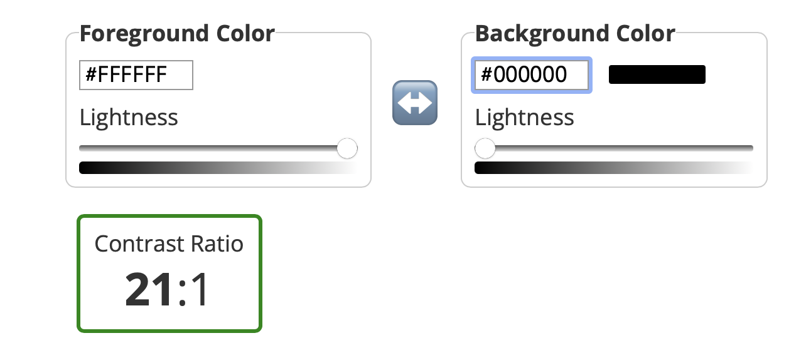
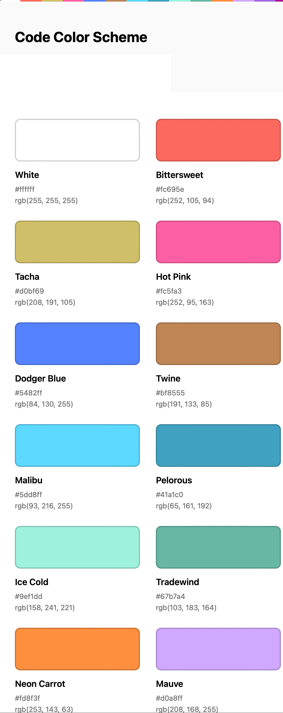

# True Black Theme

<p align="center">
  
</p>


A Pure Dark theme with the highest contrast ratio eyes has ever known.
I have been struggling a lot with all the outdated IntelliJ UI components; looking at what is the industry offers, we
still tied to 10 years old Java UI. Additionally, we have themes that make it harder to make the IDE look nicer on
High-Resolution displays.
Yet I decided to eliminate all the clutter in the IDE and use a Pure #000000 and Pure #FFFFFF based theme.

<p align="center">
  
</p>

## Setup

### [Plugin marketplace (recommended) 🛒](https://plugins.jetbrains.com/plugin/19348-true-black)

- Go to Preferences | Plugins | Marketplace and search for True Black theme
  Install the plugin
- When prompted, restart your IDE.

### Manual 🔨

To install the plugin manually, use the following steps.

- Download the ZIP file from the [latest release](https://github.com/ahmed3elshaer/Intelij-True-Black/releases/latest)
  on GitHub.
- Go to Preferences | Plugins in your editor and click the gear icon at the top.
- Click Install Plugin from Disk...
- Select the ZIP file you downloaded.
- When prompted, restart your IDE.

After installing the theme, go to Preferences | Appearance & Behavior | Appearance and select "True Dark" in the theme
dropdown. Click the OK button to apply the changes, So you can start enjoying The Pure Dark theme. That your screen
deserves!.

## Tips 🌟

- Use one of the awesome fonts in [here](https://github.com/ProgrammingFonts/ProgrammingFonts)!
- Make Sure to hide all the non-essential Windows Tools, go to View | Appearance | Uncheck what's not important; for
  myself, I keep only (Status Bar, Toolbar), and Keyboard Shortcuts is enough.
- [Atom Icons](https://plugins.jetbrains.com/plugin/10044-atom-material-icons) is recommended.
- Use a good IDE font to Preferences | Appearance & Behavior | Appearance | Check "Use custom font" | Select "Futura"
  for example.

## Features 🛰️

- Easy on the Eye with the highest contrast ratio.
<p align="center">
  
</p>
- Cleans the clutter of the IDE and simplifies color usage to simple 3 degrees of black.
- Beautiful Code color scheme based on Xcode using the awesome Xcode-theme plugin.

## Color Palette 🎨

<p align="center">
  
</p>

## Thanks 🙏🏻

Thanks to [Zihan Ma](https://github.com/WhiteVermouth), who created
the [Xcode-Theme](https://github.com/WhiteVermouth/XcodeTheme) that this project is based on. Without that starting
point, this plugin may have never been created.

## This is a fork of existing theme https://github.com/WhiteVermouth/XcodeTheme

## Licence
### MIT License
```aidl
MIT License

Copyright (c) 2022 Ahmed Elshaer

Permission is hereby granted, free of charge, to any person obtaining a copy
of this software and associated documentation files (the "Software"), to deal
in the Software without restriction, including without limitation the rights
to use, copy, modify, merge, publish, distribute, sublicense, and/or sell
copies of the Software, and to permit persons to whom the Software is
furnished to do so, subject to the following conditions:

The above copyright notice and this permission notice shall be included in all
copies or substantial portions of the Software.

THE SOFTWARE IS PROVIDED "AS IS", WITHOUT WARRANTY OF ANY KIND, EXPRESS OR
IMPLIED, INCLUDING BUT NOT LIMITED TO THE WARRANTIES OF MERCHANTABILITY,
FITNESS FOR A PARTICULAR PURPOSE AND NONINFRINGEMENT. IN NO EVENT SHALL THE
AUTHORS OR COPYRIGHT HOLDERS BE LIABLE FOR ANY CLAIM, DAMAGES OR OTHER
LIABILITY, WHETHER IN AN ACTION OF CONTRACT, TORT OR OTHERWISE, ARISING FROM,
OUT OF OR IN CONNECTION WITH THE SOFTWARE OR THE USE OR OTHER DEALINGS IN THE
```